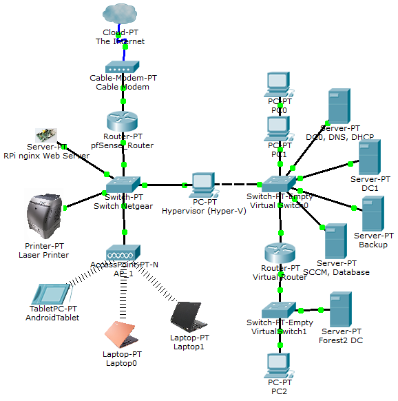

# 🖥️ Windows Server Home Lab with Active Directory

## Objective
Build a secure Windows Server 2022 Home Lab with **Active Directory**, **DNS**, and **DHCP** for hands-on cybersecurity learning and enterprise environment simulation.

---

## Lab Goals
- Install and configure **Windows Server 2022** in a virtualized environment.
- Set up **Active Directory Domain Services (AD DS)**.
- Configure **DNS** and **DHCP** for network management.
- Create and manage **users, groups, and organizational units (OUs)**.
- Apply **Group Policy Objects (GPOs)** for security hardening.

---

## Lab Setup

### 1. Environment
- **Virtualization Software:** VirtualBox / VMware Workstation
- **VMs:**  
  - Windows Server 2022 (Domain Controller)  
  - Windows 10/11 (Client Machines)

### 2. Installation Steps
1. Install **Windows Server 2022** on VM.
2. Configure network adapter (Host-Only / Internal Network).
3. Install **Active Directory Domain Services** via Server Manager.
4. Promote the server to a **Domain Controller**.
5. Configure **DNS** and **DHCP** roles.
6. Create test **users, groups, and OUs**.
7. Apply **GPOs** for password policy, desktop restrictions, and audit logging.

---

## Network Diagram

---

## Skills Demonstrated
- Windows Server Administration
- Active Directory Management
- DNS & DHCP Configuration
- Group Policy Implementation
- Network Diagramming
- Security Hardening

---

## Reports
- [Security Hardening Guide](reports/security-hardening-guide.md)
- [Lab Summary](reports/lab-summary.md)

---

## Next Steps
- Add **File Server Role** for shared resources.
- Implement **BitLocker** for drive encryption.
- Integrate with **SIEM** for log monitoring.
